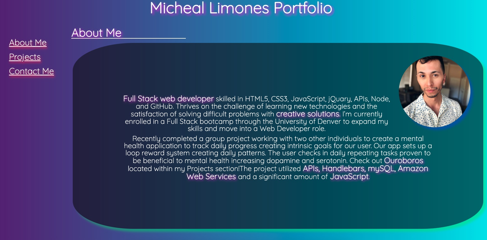

# Zesty_Portfolio

## Description

This is my current portfolio that I created using basic HTML, CSS, and JavaScript. The portfolio assignments we previously worked on through the University of Denver Boot Camps did not feel like my design and I wanted to showcase something that felt more personalized. I added colors 🌈, some javascript 💻, a pinch of animation 🤏, and a dash of flare! ✨

Allthough this portfolio page doesn't demonstrate all my coding capabilities it was fun to work on.

## Table of Contents

- [Visual Example](#visual-example)
- [Deployed Site](#deployed-site)
- [Tech Used](#tech-used)
- [Questions](#questions)
- [License](#license)

## Visual Example

(<a href="#top">back to top</a>)

## Deployed Site

https://zestylimones.github.io/Zesty_Portfolio/

(<a href="#top">back to top</a>)

## Tech Used

(<a href="#top">back to top</a>)

## Questions

If you have any questions you can reach me via:

- email: michlimones@gmail.com
- LinkedIn: https://www.linkedin.com/in/micheal-limones/

(<a href="#top">back to top</a>)

## License

MIT

(<a href="#top">back to top</a>)

